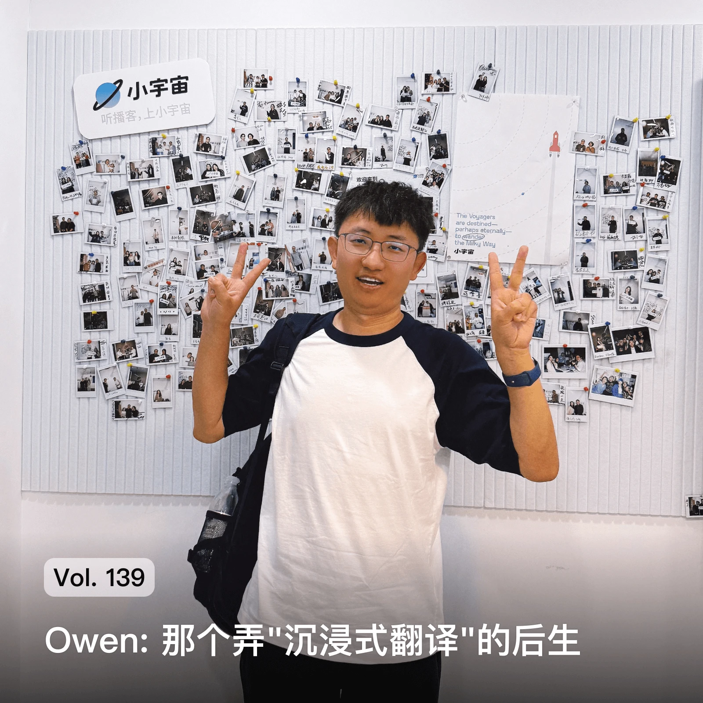
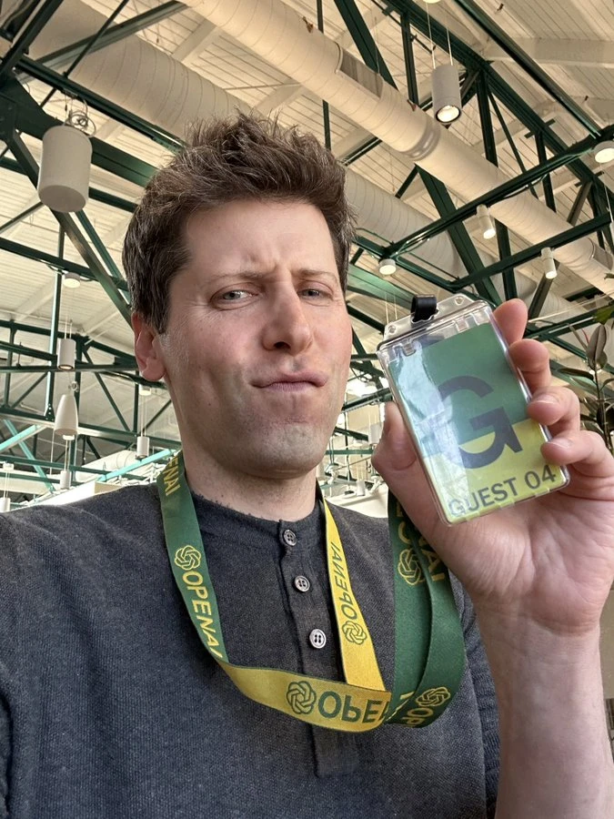
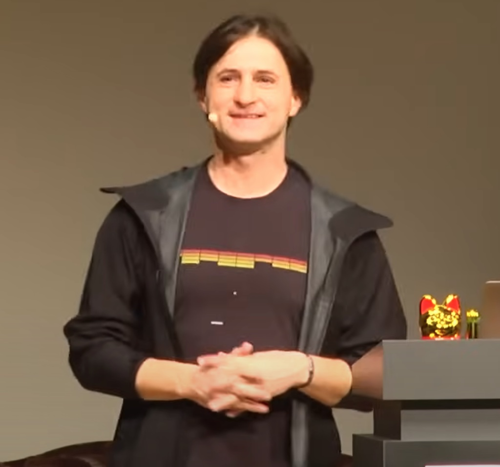
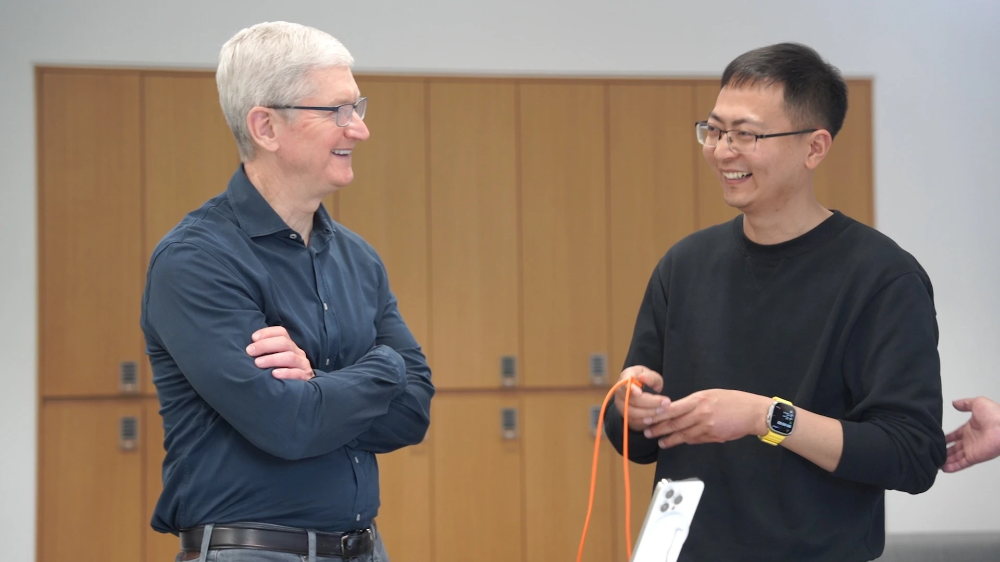
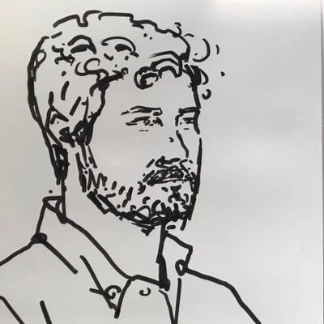

## yulu

制作精美的博客，软件工程师，也研究理财与保险

[[为什么我的工作效率降低了](https://littlecheesecake.me/blog2/2013/04/04/on-efficiency.html)]
[[理财频道](https://littlecheesecake.me/money.sense/cn/posts/)]

## owenyoung

沉浸式翻译作者

[[关于我和这个博客](https://www.owenyoung.com/about/)]
[[Owen 聊沉浸式翻译的起源、裸辞三年的经历、做穷人也能用的产品、大亚湾的生活](https://www.youtube.com/watch?v=R6AGF-oAHPg)]

## Anthony Fu

靠开源就能生活的很好的人，yihong说Anthony是宇宙最强前端开发者

[[关于 Yak Shaving](https://antfu.me/posts/about-yak-shaving-zh)]
[[请提供最小重现](https://antfu.me/posts/why-reproductions-are-required-zh)]

## 艾逗笔

mcp.so开发者

[[2024，我追过的 AI 风口](https://idoubi.cv/blogs/my-ai-2024)]
[[我跑通了全球收付款的流程](https://idoubi.cv/blogs/get-paied-all-over-the-world)]

## Hawstein

算法题老师，独立创作者，左程云（在马士兵教育教算法的老师）的老同事

[[一个独立创造者的五年](https://hawstein.com/2023/07/12/five-years-of-an-indie-hacker/)]
[[不上班的 613 天](https://hawstein.com/2020/02/17/be-an-indie-hacker-for-613-days/)]

## Randy

《代码之外》播客主播，youtuber，会唱歌、会录歌的程序员

[[30 分钟 vibe coding 复刻 iPod Classic](https://www.youtube.com/watch?v=by3qe66xjPs)]
[[奉献 苏芮 Cover | Randy](https://www.youtube.com/watch?v=4EWTVUB3aT4)]

## pseudoyu

喜欢写作的程序员，web3行业，数字游民

[[过去这十年](https://www.pseudoyu.com/posts/weekly_review_100)]
[[当一个程序员开始在博客写作](https://www.xiaoyuzhoufm.com/episode/682b17c6457b22ce0d76d912)]

## Limboy

图拉鼎在博客中介绍的一个采访了很多开发者的播客制作者

[[独立创作是一种生活方式](https://limboy.me/posts/independent-creation-is-a-lifestyle)]
[[ByteTalk播客主页](https://bytetalk.fm/)]

## Paul Graham

《黑客与画家》作者，YC创始人

[[How to Do Great Work](https://paulgraham.com/greatwork.html)]
[[How to Lose Time and Money](https://paulgraham.com/selfindulgence.html)]

## Sam Altman

OpenAI CEO

[[Productivity](https://blog.samaltman.com/productivity)]
[[How to Be Successful](https://blog.samaltman.com/how-to-be-successful)]

## Nicholas Carlini

当前在Anthropic工作，之前是Google(Deep Mind)的研究科学家

[[How I Use AI](https://nicholas.carlini.com/writing/2024/how-i-use-ai.html)]
[[Why I attack](https://nicholas.carlini.com/writing/2024/why-i-attack.html)]

## Bernardo

## 云风

原网易游戏核心成员，《大话西游》重要开发者

[[离开，是为了新的开始](https://blog.codingnow.com/2011/09/new_beginning.html)]

## Julia Evans

Make hard things Easy

[[How to add a directory to your PATH](https://jvns.ca/blog/2025/02/13/how-to-add-a-directory-to-your-path/)]

## wunderwuzzi

Security Engineer who care about mcp

[[Model Context Protocol (MCP): Landscape, Security Threats](https://news.ycombinator.com/item?id=43616282)]

## Sharon Brizinov

一个从git误提交密码中赚了6.4万美元的安全研究员

[[How I Made $64K from Deleted Files: A Bug Bounty Story](https://medium.com/@sharon.brizinov/how-i-made-64k-from-deleted-files-a-bug-bounty-story-c5bd3a6f5f9b)]

## Daniel Stenberg

curl的作者

[[How I do it](https://daniel.haxx.se/blog/2025/07/13/how-i-do-it/)]

## 图拉鼎

'良渚文化村村民'独立开发者

[[忆奶奶与我的二三事](https://imtx.me/blog/in-memory-of-grandma/)]
[[记在 limboy 的 ByteTalk 播客上聊独立开发的经历](https://imtx.me/blog/talk-about-my-indie-developer-experience-on-bytetalk/)]

## Derek Sivers

CD Baby创始人，乔布斯的itunes平台也和他打过交道

[[Just selling my CD](https://sive.rs/ayw3)]

## geekplux

代码之外播客发起人

[[我的 Workspaces 十年进化史](https://geekplux.com/posts/workspaces)]

## 勾股

weex重要开发者

## Linghao Zhang

生活在湾区的Google程序员

## Shu Ding

在Vercel工作的程序员与设计师

## yihong

一个生活在大连喜欢使用github的沈阳人、开发者

[[连续跑了 365 天](https://blog.yihong0618.me/issue-306/)]

## Frost

python开发者,和yetone都在BentoML工作

[[我「接见」了诺奖得主](https://frostming.com/2024/meet-with-paul/)]

## xuanwo

yihong写在我崇拜的人里的人

[[How I Vibe Coding?](https://xuanwo.io/2025/06-how-i-vibe-coding-sept-2025-edition/)]

## 汪二 (Haozes)

独立开发者，Apple Watch平台上开发了乐摇摇APP，统计跳绳的个数，既能当程序员，又能赚钱，还有个好身体，汪二的工作太有意义啦

[[我需要向这个世界证明什么吗？--个体户开发者的5年](https://blog.yaoyaojumprope.com/blog/2025/01/01/5-years/)]

## Takuya Matsuyama

Inkdrop（笔记SaaS）作者，独立开发者，沉浸式编程，看了他的youtube视频让我静下心来安心写代码

[[For beginners: How to create a 'link in bio' page for Instagram (No frameworks)](https://youtube.com/watch?v=u71pHOyvBp0)]
[[Setting up new M1 Max MacBook Pro Apps that I use for my app dev](https://www.youtube.com/watch?v=RNqDkF17ogY)]

## Eric Migicovsky

一个教人怎么自己做智能手表的人

## Corey Chiu

## Justin3go

2001年出生的，生活在重庆的独立开发者，前端工程师，喜欢摄影，喜欢打羽毛球

## Dank

[[14个逻辑驱动的UI设计技巧，助您改善任何界面](https://dankying.com/posts/20250701-14-logic-driven-ui-design-tips-to-improve-any-interface/)]

## Depp Wang

[[我家的装修设计](https://depp.wang/2024/decoration-design/)]

## 鱼鱼

一个喜欢矿石的人

[[矿物站目录导览](https://blog.wraith615.xyz/mineralindex)]
